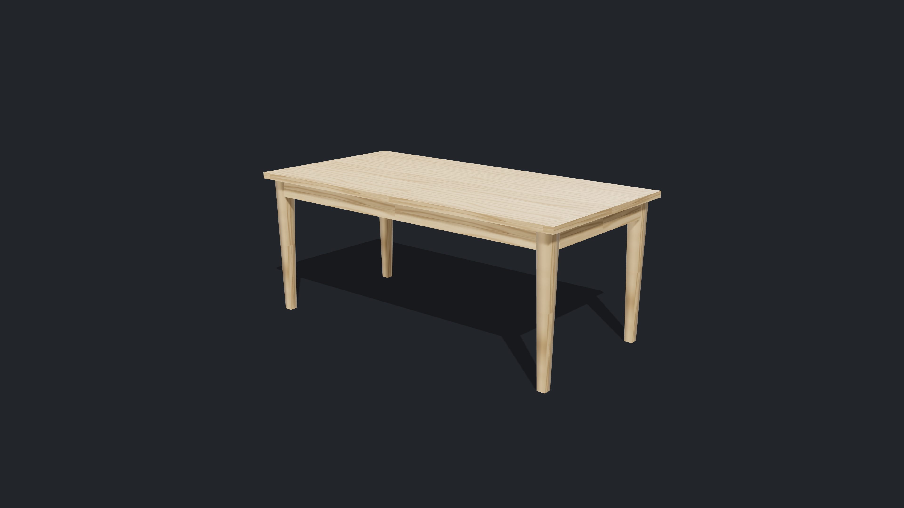
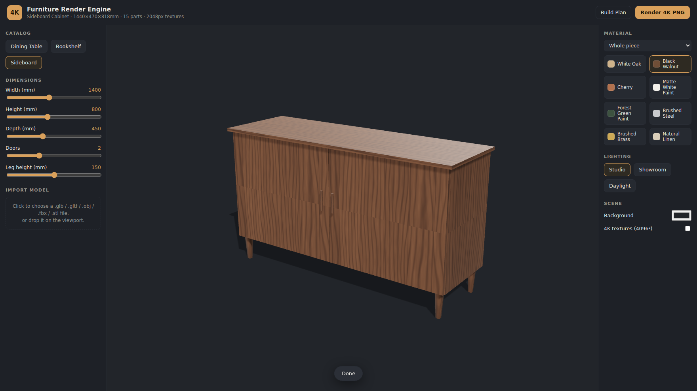
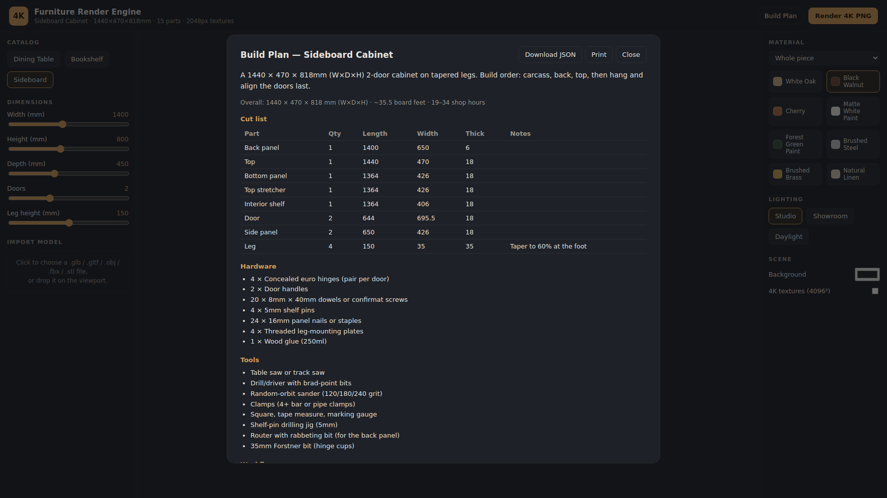

# 4kGraphics — Furniture Render Engine

A 4K rendering engine for designed furniture. It renders pieces with physically-based
materials at full 3840×2160 resolution, generates the woodworking **build plan** (cut
list, hardware, tools, step-by-step workflow) for every parametric piece, and ships in
three forms so other apps can use it:

| Package | What it is |
| --- | --- |
| [`@4kgraphics/engine`](packages/engine) | Embeddable TypeScript library (Three.js/WebGL): scene, materials, loaders, snapshot renderer, build-plan generator |
| [`@4kgraphics/server`](packages/server) | Headless render API — `POST` a furniture spec, receive a 4K PNG or a build-plan JSON |
| [`apps/demo`](apps/demo) | Browser demo UI that exercises the whole engine |


*3840×2160 output from the headless service: parametric table, procedural oak, studio lighting, 2× supersampling.*

## Features

- **True 4K output** — 3840×2160 stills with 2× supersampling (7680×4320 internal render),
  rendered in a dedicated offscreen context so the interactive viewport size never matters.
- **Procedural 4K PBR materials** — oak, walnut, cherry (edge-glued plank simulation with
  per-plank grain), paints, brushed steel/brass, and linen, generated at up to 4096²
  with matching color, roughness, and normal maps. No texture assets to download.
- **Parametric furniture** — tables, bookshelves, cabinets, drawer boxes, cabinet doors,
  drawer fronts, and full drawer units, defined by real dimensions in millimeters.
  Geometry, UVs (grain direction per part), and the build plan all derive from one part
  layout, so the render and the cut list can never disagree.
- **Build plans** — cut list with grain-oriented dimensions, hardware list, tool list,
  assembly workflow, board-feet estimate, and shop-hours estimate for every parametric piece.
- **Model import** — glTF, GLB, OBJ, FBX, and STL with automatic unit guessing
  (mm/cm/inches/meters) and floor placement.
- **Studio lighting presets** — studio, showroom, and daylight rigs with soft shadows and
  image-based environment lighting.
- **Headless render API** — the same engine driven by headless Chromium (software WebGL
  works on GPU-less servers), for backend pipelines and non-JS apps.

| Demo UI | Build plan |
| --- | --- |
|  |  |

## Quickstart

```bash
npm install
npm run build        # builds engine → server → demo
npm test             # engine unit tests

npm run demo         # demo UI on http://localhost:5173
npm run serve        # render API on http://localhost:8787
```

### Render a 4K image over HTTP

```bash
curl -X POST http://localhost:8787/v1/render \
  -H 'content-type: application/json' \
  -d '{
        "spec": { "kind": "table", "widthMm": 1800, "depthMm": 900, "heightMm": 750,
                  "topThicknessMm": 32, "legStyle": "tapered", "legThicknessMm": 70,
                  "legInsetMm": 40, "apron": true, "apronHeightMm": 90 },
        "material": "walnut",
        "lighting": "studio",
        "textureSize": 4096
      }' \
  -o table-4k.png
```

### Embed the engine in your app

```ts
import { FurnitureEngine, defaultTableSpec } from '@4kgraphics/engine';

const engine = new FurnitureEngine({ container: document.querySelector('#viewer')! });
engine.showFurniture(defaultTableSpec());
engine.setMaterial('walnut');
engine.setMaterial('steel', 'Leg');          // per-part materials

const png = await engine.renderSnapshot();    // 3840×2160 Blob
const glb = await engine.exportGLB();          // .glb bytes for WebXR / Scene Viewer
const usdz = await engine.exportUSDZ();        // .usdz bytes for iOS Quick Look
const plan = engine.getBuildPlan();           // cut list, hardware, steps
```

### AR for the storefront

`POST /v1/ar` builds per-configuration GLB + USDZ (real-world scale, metres) and
returns stable, CORS-accessible URLs for `<model-viewer>`:

```bash
curl -X POST http://localhost:8787/v1/ar \
  -H 'content-type: application/json' \
  -d '{ "spec": { "kind": "drawerbox", "widthMm": 500, "depthMm": 450, "heightMm": 150,
                  "stockThicknessMm": 13, "bottomThicknessMm": 6, "joinery": "halfblind" } }'
# → { configHash, glbUrl, usdzUrl, posterUrl }
```

```html
<model-viewer src="{glbUrl}" ios-src="{usdzUrl}" poster="{posterUrl}"
  ar ar-modes="webxr scene-viewer quick-look" ar-scale="fixed"
  camera-controls shadow-intensity="1"></model-viewer>
```

Full API reference: [docs/API.md](docs/API.md) ·
Project roadmap and workflow: [docs/PLAN.md](docs/PLAN.md) ·
Product vision & design standards (Atelier3D): [docs/00-overview.md](docs/00-overview.md)

## Repository layout

```
packages/engine/   core library
  src/parametric/    furniture specs → part layouts → geometry
  src/materials/     procedural texture generators + material library
  src/lighting/      light rig presets
  src/render/        4K snapshot renderer
  src/loaders/       glTF/OBJ/FBX/STL import
  src/buildplan/     cut list / workflow generation
packages/server/   Express API + headless-Chromium render harness
apps/demo/         Vite demo application
docs/              roadmap, API reference, sample renders
```
